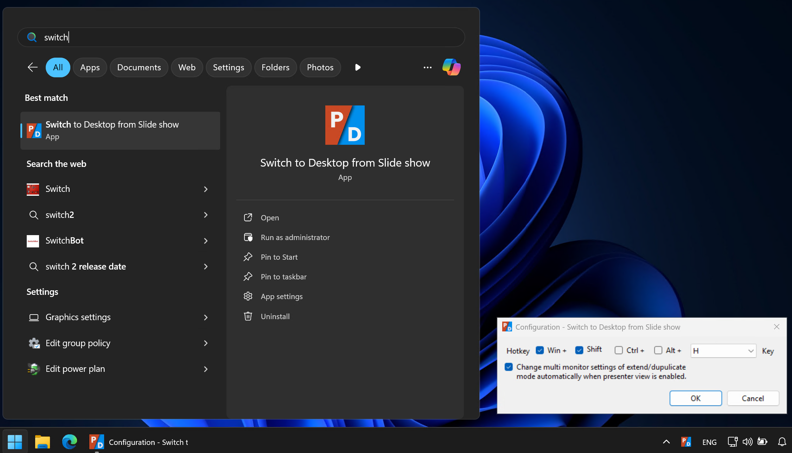

# Switch to Desktop from Slide show

## Summary

This is an application for Windows OS that allows you to toggle hiding or showing the PowerPoint slide show window by keyboard shortcut (the default key bindings is **`Win` + `Shift` + `H`**).

If you use presenter view with multi-monitor, this app also can toggle extend/duplicate display mode automatically sync with show/hide the slide show window.

## How to use

Start the "Switch to Desktop from Slide show" app from the Start menu, then it stays in the task tray.

While the "Switch to Desktop from Slide show" app is staying in the task tray, you can toggle hiding/showing the PowerPoint slide show window by keyboard shortcut.

You can quit this app, and you can change keyboard shortcut bindings, from the task tray icon of this app.

## System Requirements

- Windows 10, 11, or later
- .NET Framework 4.6, or later

## Download

You can download a zip archived binary package from [Release page](https://github.com/jsakamoto/SwitchToDesktopFromSlideshow/releases).

## License

[GNU General Public License v3.0](LICENSE)